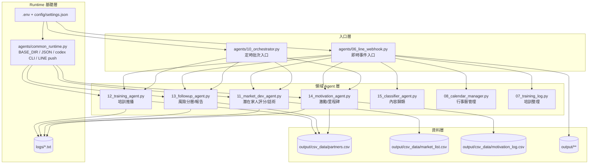
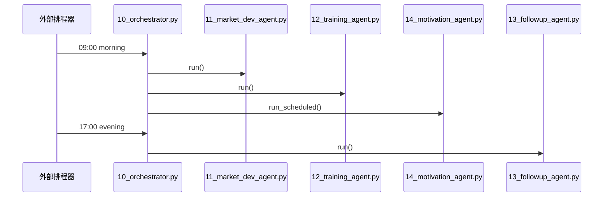
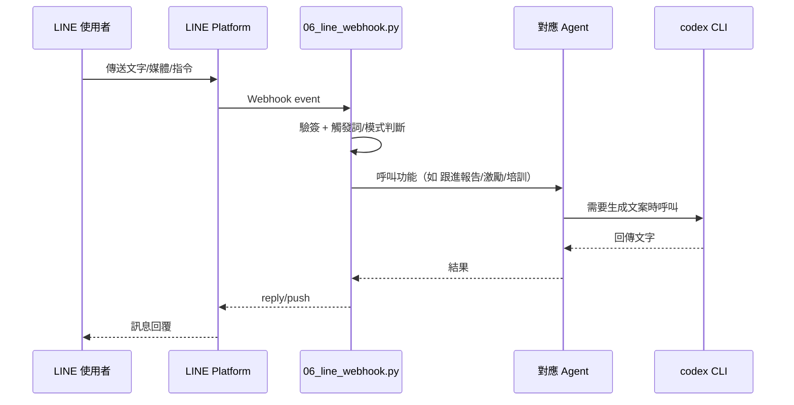

# 系統架構圖（分支：`codex/conduct-code-review-for-codex-branch`）

> 以下以目前程式碼實作為準，聚焦「新 Agent 系統 + LINE Webhook + 排程與資料流」。

## 1) 高階架構（Context）

```mermaid
flowchart LR
    User[使用者/夥伴]\n(LINE) --> LINEAPI[LINE Messaging API]
    LINEAPI --> Webhook[06_line_webhook.py\nFlask Webhook]

    Webhook --> Router[指令/意圖路由\n觸發詞 + 模式判斷]
    Router --> A11[11_market_dev_agent.py]
    Router --> A12[12_training_agent.py]
    Router --> A13[13_followup_agent.py]
    Router --> A14[14_motivation_agent.py]
    Router --> A15[15_classifier_agent.py]
    Router --> Cal[08_calendar_manager.py]
    Router --> TrainLog[07_training_log.py]

    Orchestrator[10_orchestrator.py\n每日排程調度] --> A11
    Orchestrator --> A12
    Orchestrator --> A13
    Orchestrator --> A14

    A11 --> CSV1[(output/csv_data/market_list.csv)]
    A12 --> CSV2[(output/csv_data/partners.csv)]
    A13 --> CSV2
    A14 --> CSV2
    A14 --> CSV3[(output/csv_data/motivation_log.csv)]

    A11 --> CodexCLI[codex exec via common_runtime.py]
    A12 --> CodexCLI
    A13 --> CodexCLI
    A14 --> CodexCLI

    A11 --> Push[LINE Push API]
    A12 --> Push
    A13 --> Push
    A14 --> Push
    Push --> LINEAPI
```

## 2) 應用層分解（Container / Module）



## 3) 關鍵流程（Sequence）

### A. 每日排程流程



### B. LINE 即時指令流程



## 4) 設計重點與限制

- **優點**
  - 「Webhook（即時）」與「Orchestrator（批次）」雙入口，能同時支援互動與排程任務。
  - 各 Agent 以單一職責切分，並透過 `common_runtime.py` 共用核心能力。
  - 資料層採 CSV/JSON，本地可落地、容易檢視。

- **目前限制**
  - 多數模組仍含 Windows 絕對路徑字串（歷史相容），跨環境部署需再抽象化。
  - 資料儲存以檔案為主（CSV/JSON），並發與一致性保護有限。
  - AI 生成依賴 `codex exec` 外部命令，需注意 timeout / 回傳失敗重試策略。

## 5) 分支審查建議（可做為 Code Review Checklist）

1. 路徑管理統一改以 `common_runtime.BASE_DIR` + 相對路徑。
2. 將 CSV I/O 抽象成 repository layer，降低重複程式碼。
3. 為 `run_codex_cli` 加入 retry/backoff 與可觀測 metrics。
4. Webhook 指令路由拆分 registry（指令 -> handler）以提升可測試性。
5. 為 `orchestrator` 加入任務級別健康檢查與告警。
