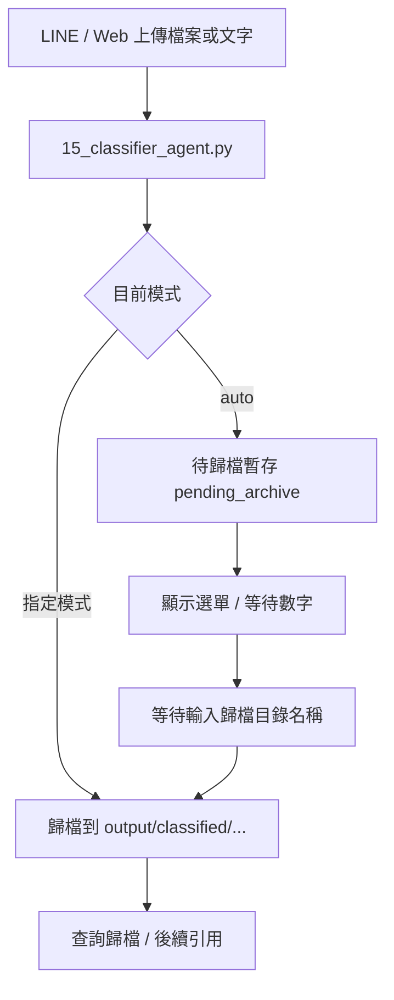
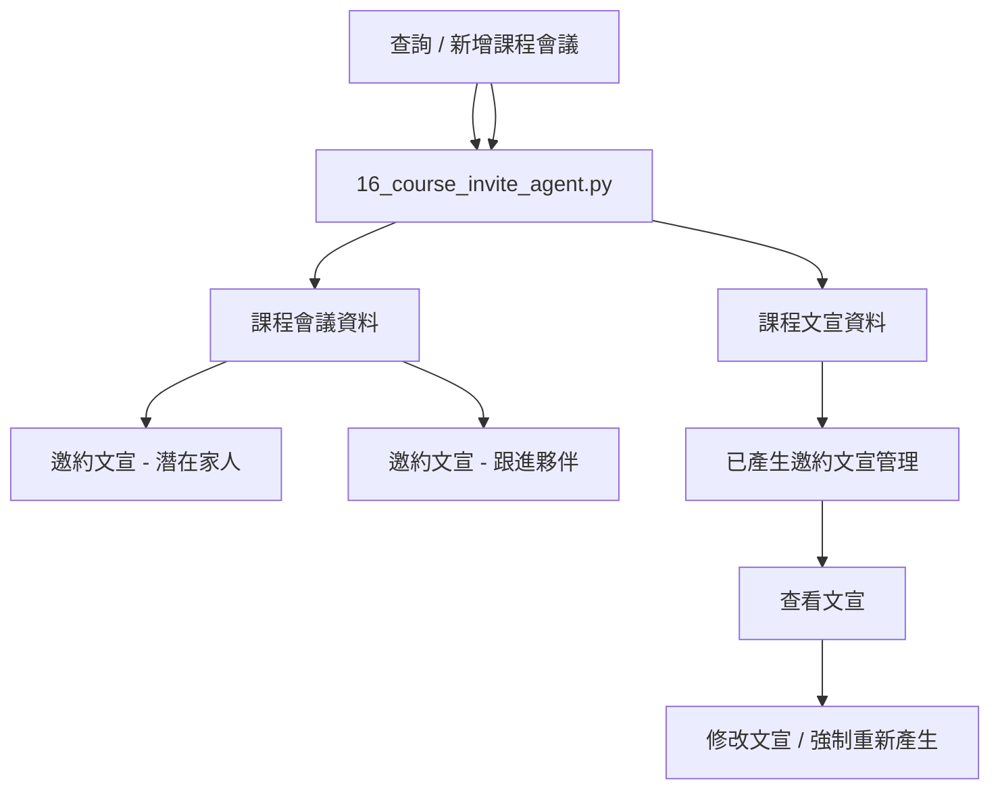
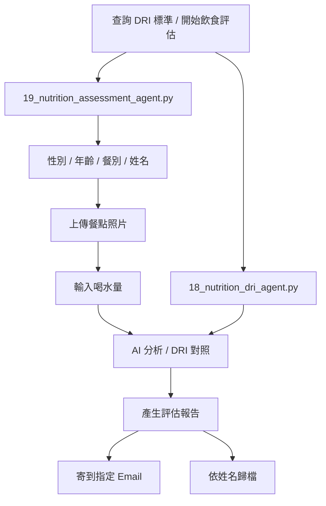
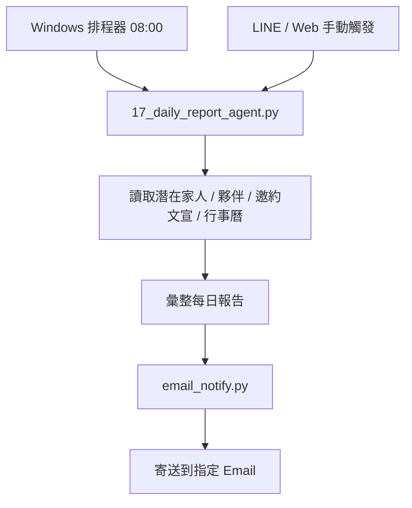

# 系統架構流程圖

本文件描述目前系統的主要入口、路由層、核心 Agent、資料儲存與外部輸出流程。

## 1. 整體架構總覽

```mermaid
flowchart TD
    U1[LINE 使用者]
    U2[網頁使用者]
    U3[Windows 排程器]

    W[agents/06_line_webhook.py<br/>Flask App 組裝層]

    LE[agents/webhook_line_events.py<br/>LINE 事件處理]
    LM[agents/webhook_line_media.py<br/>LINE 媒體處理]
    CR[agents/webhook_command_router.py<br/>指令路由]
    WV[agents/webhook_web_views.py<br/>Web UI / Dashboard]
    AR[agents/webhook_api_routes.py<br/>/api 路由]
    RT[agents/webhook_runtime.py<br/>LINE 回覆 / 推播 / 驗簽]
    ST[agents/webhook_state.py<br/>Session / 狀態管理]
    TX[agents/webhook_text.py<br/>選單 / Help / 文案]
    IN[agents/webhook_intent.py<br/>意圖 / 狀態摘要]

    C15[15_classifier_agent.py<br/>分類 / 待歸檔]
    C08[08_calendar_manager.py<br/>行事曆]
    C09[09_partner_engagement.py<br/>夥伴管理]
    C11[11_market_dev_agent.py<br/>潛在家人]
    C12[12_training_agent.py<br/>培訓查詢]
    C13[13_followup_agent.py<br/>跟進報告]
    C14[14_motivation_agent.py<br/>激勵 / 里程碑]
    C16[16_course_invite_agent.py<br/>課程 / 邀約文宣]
    C17[17_daily_report_agent.py<br/>每日報告]
    C18[18_nutrition_dri_agent.py<br/>DRI 標準]
    C19[19_nutrition_assessment_agent.py<br/>飲食評估]
    C07[07_training_log.py<br/>培訓整理]
    ORCH[10_orchestrator.py<br/>批次 / 排程調度]
    MAIL[email_notify.py<br/>寄信]

    FS[(output/* 資料檔案)]
    EXT1[LINE Messaging API]
    EXT2[Email / Gmail]
    EXT3[衛福部 DRI PDF]
    EXT4[Codex / CLI 分析]

    U1 -->|Webhook| W
    U2 -->|/web /api| W
    U3 -->|daily_report / batch| ORCH

    W --> LE
    W --> WV
    W --> AR
    W --> RT
    W --> ST
    W --> TX
    W --> IN

    LE --> LM
    LE --> CR
    AR --> CR
    WV --> CR

    CR --> C15
    CR --> C08
    CR --> C09
    CR --> C11
    CR --> C12
    CR --> C13
    CR --> C14
    CR --> C16
    CR --> C17
    CR --> C18
    CR --> C19
    CR --> C07

    LM --> C15
    LM --> C19
    AR --> C19
    ORCH --> C17
    ORCH --> C11
    ORCH --> C12
    ORCH --> C16

    C15 --> FS
    C08 --> FS
    C09 --> FS
    C11 --> FS
    C12 --> FS
    C13 --> FS
    C14 --> FS
    C16 --> FS
    C17 --> FS
    C18 --> FS
    C19 --> FS
    C07 --> FS

    C17 --> MAIL
    C19 --> MAIL
    MAIL --> EXT2

    C18 --> EXT3
    C19 --> EXT4
    C07 --> EXT4
    RT --> EXT1
```



## 2. LINE 流程

```mermaid
flowchart LR
    A[LINE 訊息 / 圖片 / 音檔 / 影片 / 檔案]
    B[/webhook]
    C[webhook_line_events.py]
    D{訊息類型}
    E[文字指令]
    F[媒體處理]
    G[webhook_command_router.py]
    H[各 Agent]
    I[reply_message / push_message]
    J[LINE 回覆]

    A --> B --> C --> D
    D -->|text| E
    D -->|image/audio/video/file| F
    E --> G --> H --> I --> J
    F --> H --> I --> J
```

### LINE 主要功能群

- `5168` 執行選單
- 潛在家人管理
- 夥伴管理 / 跟進 / 激勵 / 里程碑
- 行事曆查詢 / 新增 / 修改 / 刪除 / 圖片匯入
- 歸檔模式設定 / 待歸檔兩階段執行
- 培訓記錄整理
- 課程會議 / 課程文宣 / 已產生邀約文宣管理
- 每日報告寄送
- DRI 查詢 / 飲食評估 / 照片分析 / 報告寄送

## 3. 網頁流程

```mermaid
flowchart LR
    A[瀏覽器]
    B[/web]
    C[webhook_web_views.py]
    D[Dashboard 按鈕 / 表單]
    E[/api/command]
    F[/api/upload]
    G[/api/pending*]
    H[webhook_api_routes.py]
    I[process_web_command]
    J[webhook_command_router.py]
    K[各 Agent]
    L[畫面更新 / 結果訊息]

    A --> B --> C --> D
    D --> E --> H --> I --> J --> K --> L
    D --> F --> H --> K --> L
    D --> G --> H --> K --> L
```

### 網頁主要區塊

- 市場開發
- 培訓系統
- 夥伴陪伴
- 行事曆
- 歸檔模式
- 培訓記錄
- 課程會議邀約
- 每日報告
- 營養評估

## 4. 歸檔流程



### 歸檔特色

- 支援多檔累積後再分類
- 支援文字、圖片、音檔、影片、文件
- 支援一般歸檔、人員＋模式歸檔、故事歸檔、課程文宣歸檔、行事曆圖片

## 5. 課程邀約流程



### 跟進夥伴邀約文宣

1. 先選夥伴分類 `A / B / C`
2. 再選人
3. 再選會議活動
4. 產生邀約文宣

### 已產生邀約文宣管理

1. 查詢今日之後已產生的邀約文宣
2. 選一筆
3. 查看文宣
4. 選擇是否修改

## 6. 營養評估流程



### 營養評估輸出

- 缺乏的營養素
- 可能長期出現的身體警訊
- 原因說明
- 報告寄送
- 依姓名歸檔照片與報告

## 7. 每日報告流程



### 每日報告內容

- 潛在家人清單
- 跟進夥伴清單
- 已產生且在今日後的邀約文宣
- 今日後的會議活動清單

## 8. 主要資料目錄

```text
output/
  training/                 培訓逐字稿與摘要
  calendar/                 行事曆資料與圖片
  partners/                 夥伴資料
  prospects/                潛在家人資料
  classified/               分類歸檔資料
  nutrition_pdfs/           衛福部 DRI PDF
  nutrition_reports/        飲食評估報告
  pending_archive/          待歸檔暫存
  csv_data/                 CSV 匯入/相容資料
```

## 9. 目前模組分工

- [agents/06_line_webhook.py](/abs/path/C:/Users/user/claude%20AI_Agent/agents/06_line_webhook.py)
  Flask app 組裝層
- [agents/webhook_line_events.py](/abs/path/C:/Users/user/claude%20AI_Agent/agents/webhook_line_events.py)
  LINE 文字/狀態流程
- [agents/webhook_line_media.py](/abs/path/C:/Users/user/claude%20AI_Agent/agents/webhook_line_media.py)
  LINE 媒體流程
- [agents/webhook_command_router.py](/abs/path/C:/Users/user/claude%20AI_Agent/agents/webhook_command_router.py)
  LINE / Web 指令分流
- [agents/webhook_web_views.py](/abs/path/C:/Users/user/claude%20AI_Agent/agents/webhook_web_views.py)
  網頁 Dashboard 與前端按鈕
- [agents/webhook_api_routes.py](/abs/path/C:/Users/user/claude%20AI_Agent/agents/webhook_api_routes.py)
  Web API
- [agents/webhook_state.py](/abs/path/C:/Users/user/claude%20AI_Agent/agents/webhook_state.py)
  Session / 暫存狀態

